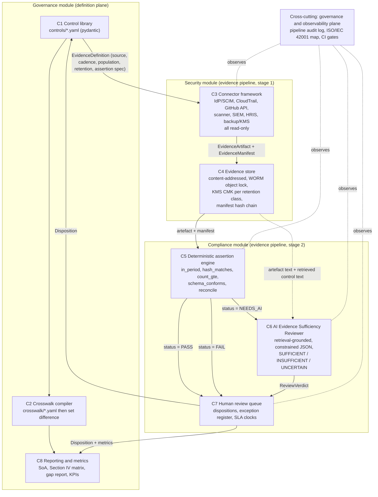
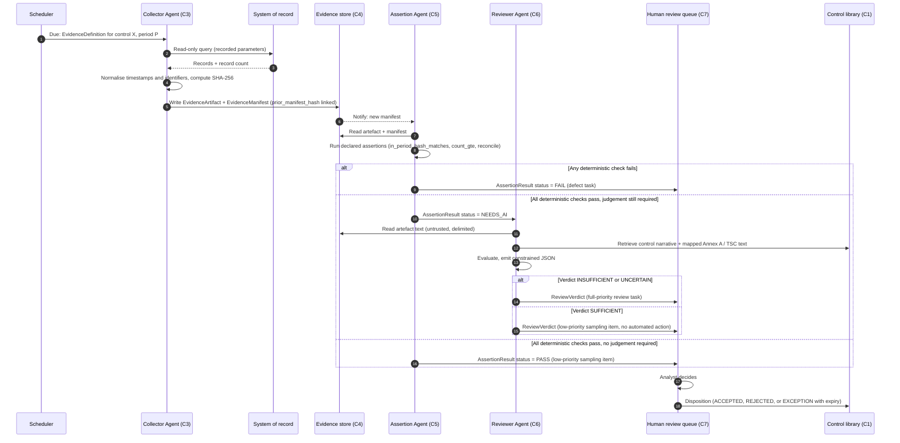
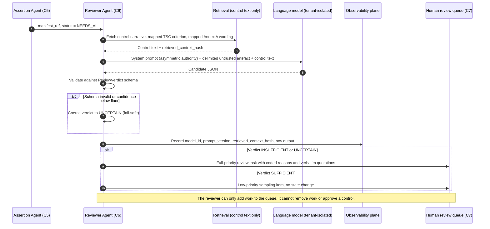
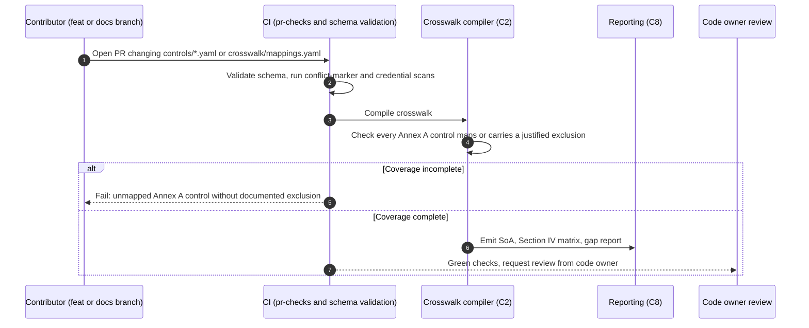
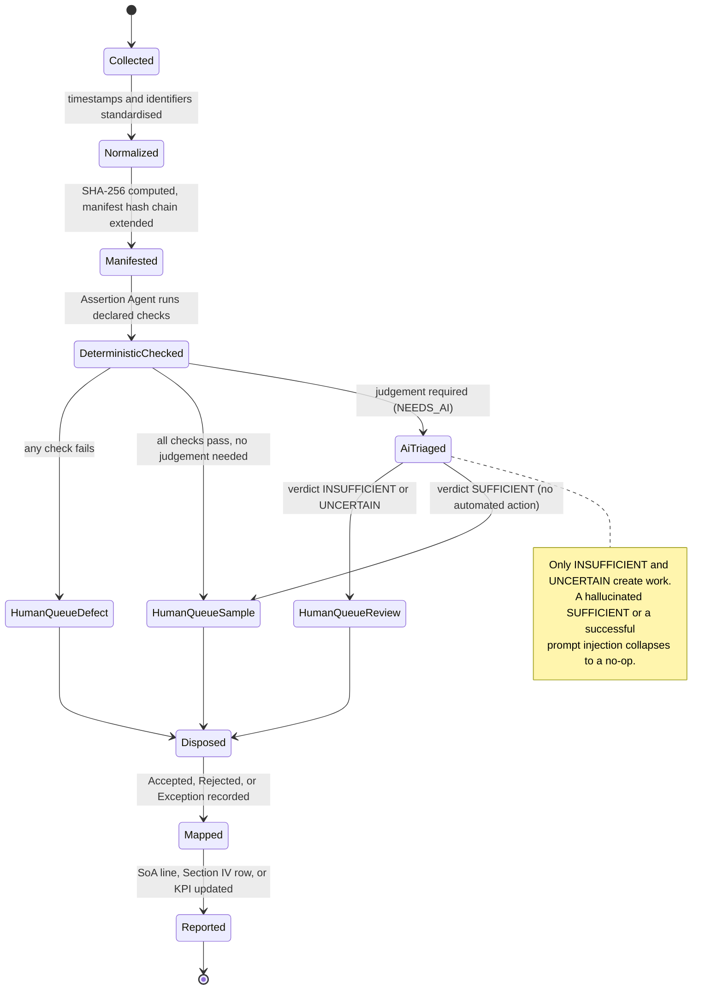
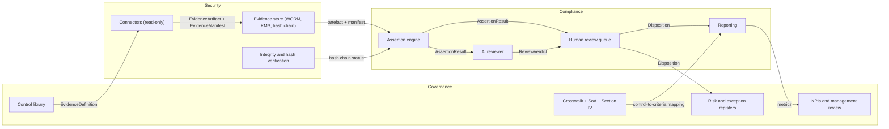

# Phase 2 — System Design and Architecture

HkS Security, Governance and Compliance Framework

## Document Control

| Field | Value |
|---|---|
| Phase | Phase 2 — System Design and Architecture |
| Status | Draft for team review |
| Date | 2026-09-01 |
| Prepared by | Ahmed Arebi (Security Engineering and Infrastructure workstream) |
| For review by | Marwan Elamami (code owner, AI and Automation), Abo Alqasem Elkorbow (GRC and Governance) |
| Source basis | `docs/reports/HKS_Final_Report_v2.md`, `docs/reports/HKS_Unified_Report_Assignment1.md`, `AGENTS.md`, `README.md` |
| Standards referenced | ISO/IEC 27001:2022, ISO/IEC 27002:2022, AICPA Trust Services Criteria (TSP section 100, 2017 with 2022 revised points of focus), AICPA Description Criteria DC section 200, ISO/IEC 42001, NIST AI RMF, OWASP Top 10 for LLM Applications |

This document initiates the Phase 2 workstream defined in `README.md`. It is a design and research deliverable. No live systems, production configurations, audit samples, or risk registers were examined in its preparation, consistent with the limitations recorded in `docs/reports/HKS_Final_Report_v2.md`.

---

## 1. Purpose and Scope

### 1.1 Purpose

Translate the Phase 1 research consensus into an implementable architecture for a compliance system that operates **one canonical control library against two assurance regimes**: ISO/IEC 27001:2022 (an Information Security Management System certified against Clauses 4 to 10 and Annex A) and SOC 2 Type 1 and Type 2 (an AICPA attestation engagement against the Trust Services Criteria under attestation standards AT-C 105 and AT-C 205).

### 1.2 In scope for Phase 2

- The Canonical Control Schema and its validation rules.
- The crosswalk data model and the compiler that generates the ISO Statement of Applicability (SoA) and the SOC 2 Section IV matrix.
- The evidence connector interface and the read-only collector contract.
- The evidence store: manifest specification, hashing and tamper-evidence, retention classes, and the key management hierarchy.
- The deterministic assertion engine.
- The AI Evidence Sufficiency Reviewer design: grounding, output schema, governance, and the evaluation harness.
- The governance and observability plane that makes the pipeline itself auditable.

### 1.3 Out of scope for Phase 2

Live deployment, real audit sampling, production credentials, and a populated risk register. Prototype implementation on mock evidence is Phase 3 per the `README.md` roadmap.

---

## 2. Objectives and Phase 2 Deliverables

| ID | Deliverable | Primary owner |
|---|---|---|
| D1 | Canonical Control Schema, machine-readable and validated | Elkorbow (GRC) |
| D2 | Crosswalk compiler producing the ISO SoA, the SOC 2 Section IV matrix, and the gap report | Elkorbow (GRC) |
| D3 | Evidence connector interface and read-only collector contract | Arebi (Security and Infrastructure) |
| D4 | Evidence store: manifest specification, hashing, tamper-evidence, and key management hierarchy | Arebi (Security and Infrastructure) |
| D5 | Deterministic assertion engine, executed before any model call | Elamami and shared |
| D6 | AI Evidence Sufficiency Reviewer design: prompts, retrieval grounding, output schema, evaluation set | Elamami (AI and Automation) |
| D7 | Governance and observability plane, mapped to ISO/IEC 42001 and the NIST AI RMF functions | Elamami and Elkorbow |

---

## 3. Architectural Invariants

Every component described below must uphold the invariants stated in `AGENTS.md` section 2. They are restated here because the architecture is derived from them.

1. **Collect once, present many times.** Controls and evidence are defined once in the canonical schema, then mapped outward to multiple frameworks. Nothing is copied into per-framework documents that can drift.
2. **Deterministic checks before AI inference.** Dates, hashes, period coverage, record counts, and population reconciliation are evaluated by comparison code before any language model is called. A question a boolean operator can answer never consumes inference tokens.
3. **Asymmetric AI authority.** The AI Evidence Sufficiency Reviewer may flag gaps and enqueue human review tasks with the verdicts `INSUFFICIENT` and `UNCERTAIN`. It cannot approve evidence or grant compliance. A `SUFFICIENT` verdict takes no automated action.
4. **Evidence is untrusted input.** Logs, commit messages, and ticket bodies are treated as untrusted data. Prompt-injection defences are mandatory: content delimiters and schema-constrained output.
5. **Read-only collector connectors.** Evidence collectors operate strictly with read-only API and IAM permissions. The compliance pipeline must never become an unauthorised write path into production.

---

## 4. High-Level System Overview

The system is a linear evidence pipeline wrapped by two supporting planes.

- **Definition plane (Governance module).** Holds the canonical control library, the crosswalk, the risk and exception registers, and the reporting logic. It answers the question "what does a sufficient control and a sufficient body of evidence look like".
- **Evidence pipeline (Security module then Compliance module).** Collects evidence from systems of record under read-only credentials, stores it with tamper-evidence, runs deterministic assertions, routes ambiguous artefacts to the AI reviewer, and lands the result in a human review queue that produces dispositions.
- **Observability plane (cross-cutting).** Records every state transition in the pipeline, including the AI reviewer's own inputs and outputs, so the compliance system can itself be audited under ISO/IEC 42001.

The strategy is the one endorsed by both Phase 1 reports: one accountable, risk-based control library, mapped outward to each framework, with evidence collected continuously from systems of record rather than produced as point-in-time screenshots.

---

## 5. System Architecture

### 5.1 Module and component map



### 5.2 Component catalogue

| ID | Component | Module | Responsibility |
|---|---|---|---|
| C1 | Control library | Governance | Canonical `ControlRecord` definitions, one YAML file per control, validated against the schema. |
| C2 | Crosswalk compiler | Governance | Resolves `crosswalk/mappings.yaml` into the SoA (ISO/IEC 27001:2022 Clause 6.1.3(c)), the SOC 2 Section IV matrix, and gap reports for new frameworks computed as a set difference. |
| C3 | Connector framework | Security | Read-only collectors per system of record. Normalises timestamps and identifiers, records query parameters and record counts, computes artefact hashes. |
| C4 | Evidence store | Security | Content-addressed object storage with WORM protection, a KMS customer-managed key per retention class, and a manifest hash chain for tamper-evidence. |
| C5 | Deterministic assertion engine | Compliance | Pure-function boolean checks over stored artefacts and manifests. Emits `PASS`, `FAIL`, or `NEEDS_AI`. |
| C6 | AI Evidence Sufficiency Reviewer | Compliance | Retrieval-grounded language model evaluation of artefacts that pass deterministic checks but need judgement. Constrained JSON output only. |
| C7 | Human review queue | Compliance | Task queue for analysts. Produces `Disposition` records and maintains the exception register with expiry-bound SLA clocks. |
| C8 | Reporting and metrics | Governance | Generates the SoA, the Section IV matrix, the gap report, management-review KPIs, and the customer-questionnaire export. |

### 5.3 The four processing agents

An "agent" here is an automated pipeline stage with a defined trigger, an input contract, an output contract, and an **authority boundary**. This is distinct from the AI coding assistants governed by `AGENTS.md`.

| Agent | Trigger | Input | Output | Authority boundary |
|---|---|---|---|---|
| Collector Agent (C3) | Schedule per `EvidenceDefinition.cadence` | Evidence definition, period, population specification | `EvidenceArtifact` bytes plus `EvidenceManifest`, written to C4 | Read-only IAM or OIDC federation. May write only to the evidence store. Records every query parameter and record count. |
| Assertion Agent (C5) | New manifest lands in C4 | Artefact, manifest, assertion specification from the control | `AssertionResult` with status `PASS`, `FAIL`, or `NEEDS_AI` | Pure functions. Store reads only. No external calls. No model calls. |
| Reviewer Agent (C6) | `AssertionResult.status == NEEDS_AI` | Delimited artefact text, plus retrieved control narrative and mapped Annex A and TSC wording | `ReviewVerdict` as constrained JSON | May emit any verdict, but only `INSUFFICIENT` and `UNCERTAIN` create work. `SUFFICIENT` is a no-op routed to the queue as a low-priority sampling item. Cannot approve, cannot modify controls, cannot write to production. |
| Audit-Prep Agent (C8 helper) | On demand, before fieldwork | All manifests, verdicts, and dispositions for a period | Evidence index mapped to the auditor's likely test plan, plus a gap list | Read-only over the evidence and disposition stores. Drafts only. A human finalises. |

---

## 6. Agent Workflows

### 6.1 Evidence collection to disposition



### 6.2 AI Evidence Sufficiency Reviewer path



### 6.3 Crosswalk compilation and reporting



---

## 7. Evidence Lifecycle State Machine



---

## 8. Data Flow Across Governance, Security, and Compliance

### 8.1 Flow overview



Direction of flow:

- **Governance to Security.** The `EvidenceDefinition` embedded in each `ControlRecord` tells the Collector Agent what to pull, how often, what population defines completeness, what retention class applies, and which deterministic assertions to run.
- **Security to Compliance.** Hashed `EvidenceArtifact` records and their `EvidenceManifest` flow to the assertion engine. Artefact text plus retrieved control text flow to the AI reviewer.
- **Compliance to Governance.** `Disposition` records update the control status and the exception register. Rolled-up metrics feed management review under ISO/IEC 27001:2022 Clauses 9.1 and 9.3.
- **Cross-cutting.** The observability plane records every transition, including the AI reviewer's inputs and outputs.

### 8.2 Data contracts

All contracts are `pydantic` models, versioned, and JSON-serialisable, per `AGENTS.md` section 6.

| Contract | Produced by | Consumed by | Core fields |
|---|---|---|---|
| `ControlRecord` | Governance C1 | C2, C5, C6, C8 | `id`, `title`, `risk_statement`, `objective`, `statement`, `owner`, `status`, `framework_mappings`, `evidence_definitions[]`, `test_procedures[]`, `exceptions[]`, `metrics[]` |
| `EvidenceDefinition` | Governance C1 | C3, C5 | `source_system`, `query_template`, `cadence`, `period`, `population_definition`, `retention_class`, `assertion_spec[]` |
| `EvidenceManifest` | Security C3 | C4, C5, C6, C8 | `collector_version`, `source_system`, `query_params`, `record_count`, `population_definition`, `collection_identity`, `collected_at`, `content_hash` (SHA-256), `storage_uri`, `retention_class`, `prior_manifest_hash` |
| `AssertionResult` | Compliance C5 | C6, C7, C8 | `manifest_ref`, `status` (`PASS`, `FAIL`, `NEEDS_AI`), `checks[]` (name, expected, actual, passed) |
| `ReviewVerdict` | Compliance C6 | C7, C8 | `manifest_ref`, `verdict` (`SUFFICIENT`, `INSUFFICIENT`, `UNCERTAIN`), `confidence`, `coded_reasons[]`, `quotations[]` (verbatim spans from the artefact), `model_id`, `prompt_version`, `retrieved_context_hash` |
| `Disposition` | Compliance C7 (human) | Governance C1, C8 | `manifest_ref`, `decision` (`ACCEPTED`, `REJECTED`, `EXCEPTION`), `rationale`, `reviewer`, `decided_at`, `exception_expiry` (optional) |
| `CrosswalkEntry` | Governance C2 | C8 | `control_id`, `annex_a_refs[]`, `tsc_refs[]`, `internal_policy_refs[]`, `coverage_status` |

### 8.3 Module responsibilities and boundaries

| Module | Owns | Must never | Enforcement |
|---|---|---|---|
| Governance | Control definitions, crosswalk, SoA and Section IV logic, risk register, exception register, KPIs | Touch raw evidence bytes; grant itself collection credentials | Schema validation in CI; SoA completeness gate over all 93 Annex A controls |
| Security | Connectors, evidence store, key management hierarchy, WORM configuration, integrity checks | Hold any write permission to production; mutate an artefact after manifesting | Read-only IAM boundary policy per connector; OIDC short-lived credentials; `pr-checks.yml` credential scan; manifest hash-chain verification job |
| Compliance | Assertion engine, AI reviewer, human review queue, reporting | Let the model raise confidence; act on a `SUFFICIENT` verdict; call the model before deterministic checks pass | The reviewer code path has no approve transition; `NEEDS_AI` is the only entry to C6; adversarial evaluation gate before C6 is enabled |

---

## 9. Canonical Control Schema

### 9.1 Proposed shape

- One YAML file per control at `controls/HKS-XX-NN.yaml` as the source of truth. One file per control keeps pull-request diffs and CODEOWNERS scoping clean.
- `hks crosswalk` resolves all controls and mappings into a generated, hash-stamped `controls.lock.json` that downstream stages read.
- The schema mirrors the control record fields recommended in `docs/reports/HKS_Final_Report_v2.md` section 8: control identifier and title, risk statement, control objective and statement, owner and status, framework mappings, evidence definitions, test procedures, exceptions, and metrics.

### 9.2 The five canonical controls and their primary mappings

Mappings are taken from `docs/reports/HKS_Final_Report_v2.md` section 7. They are illustrative pending a real ISMS scope, a selected set of SOC 2 criteria, a system description, and auditor interpretation, as both Phase 1 reports state.

| ID | Control | Primary Annex A (ISO/IEC 27001:2022) | Primary TSC (AICPA 2017 / 2022 PoF) |
|---|---|---|---|
| HKS-AC-01 | Phishing-resistant identity and access lifecycle | A.5.15 to A.5.18, A.8.2, A.8.5 | CC6.1 to CC6.3, CC6.6 |
| HKS-CM-02 | Secure change and CI/CD pipeline integrity | A.8.25, A.8.28 to A.8.32 | CC8.1, CC6.8 |
| HKS-VM-03 | Vulnerability and configuration management | A.8.8, A.8.9, A.8.19, A.5.7 | CC7.1, CC8.1 |
| HKS-LM-04 | Centralised logging, monitoring and incident response | A.8.15 to A.8.17, A.5.24 to A.5.26 | CC7.2 to CC7.5 |
| HKS-BR-05 | Ransomware-resilient backup, recovery and data protection | A.8.13, A.8.24, A.5.29 to A.5.30 | A1.2, A1.3, CC9.1 |

Note: `docs/reports/HKS_Unified_Report_Assignment1.md` lists HKS-BR-05 without A.8.24. The discrepancy between the two reports is tracked as a citation item for the GRC workstream to resolve against ISO/IEC 27001:2022 Annex A directly.

### 9.3 Crosswalk as data

- `crosswalk/mappings.yaml` holds bidirectional Annex A to control to TSC links.
- CI fails a pull request if any of the 93 Annex A controls is neither mapped to an implemented control nor carries a documented exclusion, executing ISO/IEC 27001:2022 Clause 6.1.3(c) as an automated check rather than a manual review.
- Gap reports for future frameworks such as NIST CSF 2.0, ISO/IEC 42001, or DORA are computed as a set difference, not debated in workshops.

---

## 10. Deterministic Assertion Engine

The assertion engine runs before any model call. `docs/reports/HKS_Final_Report_v2.md` section 9 estimates that roughly half of real evidence defects are caught here at zero inference cost.

Assertions are declared in `EvidenceDefinition.assertion_spec` as entries drawn from a fixed vocabulary. A fixed vocabulary is preferred over a general expression language because the five controls do not require more.

| Assertion | Checks |
|---|---|
| `in_period` | Every record timestamp falls within the stated reporting period. |
| `hash_matches` | The stored artefact hash equals the manifest `content_hash`, and `prior_manifest_hash` links correctly in the chain. |
| `count_gte(n)` | The manifest `record_count` meets or exceeds an expected minimum. |
| `schema_conforms(ref)` | The artefact validates against a named schema. |
| `population_declared` | The manifest carries a non-empty `population_definition`. |
| `reconcile(source_a, source_b, join_key)` | Two independent sources agree on the controlled population, for example IdP accounts against HRIS records, or deployments in CloudTrail against merged pull requests. |

A `reconcile` failure or a `population_declared` failure marks the control's population as untrustworthy, which both Phase 1 reports identify as a control failure in its own right regardless of how well the control otherwise operated.

---

## 11. AI Evidence Sufficiency Reviewer

### 11.1 Grounding and failure behaviour

- Retrieval scope is only the control narrative, the mapped TSC criterion, and the mapped Annex A wording. The model does not reason from memory and does not see other artefacts.
- Artefact text is wrapped in unique delimiters. The system prompt states that artefact content is untrusted data and may contain injected instructions, addressing prompt injection structurally per the OWASP Top 10 for LLM Applications.
- Output must validate against the `ReviewVerdict` schema. On a schema-validation failure or a confidence below an agreed floor, the verdict is coerced to `UNCERTAIN`, which routes to more human work rather than less.

### 11.2 Output schema (informal)

```json
{
  "manifest_ref": "string",
  "verdict": "SUFFICIENT | INSUFFICIENT | UNCERTAIN",
  "confidence": "number, 0 to 1",
  "coded_reasons": ["OUT_OF_PERIOD", "WRONG_CONTROL", "POPULATION_UNDECLARED", "..."],
  "quotations": ["verbatim spans copied from the artefact"],
  "model_id": "string",
  "prompt_version": "string",
  "retrieved_context_hash": "string"
}
```

### 11.3 Governance of the reviewer

- The reviewer is an entry in the AI system inventory with a documented purpose, data flow, owner, and retirement position, aligned to the NIST AI RMF functions (Govern, Map, Measure, Manage) and mappable onto ISO/IEC 42001 clauses.
- Every verdict records `model_id`, `prompt_version`, `retrieved_context_hash`, the raw output, and later the human `Disposition`. The reviewer's own operation is auditable, or it becomes an unevidenced control inside a framework built on evidence.

### 11.4 Evaluation harness

Per `docs/reports/HKS_Final_Report_v2.md` section 9 and `docs/reports/HKS_Unified_Report_Assignment1.md` section 8:

- Build a labelled set of approximately 200 artefacts, half deliberately defective with defects modelled on real audit findings, before the reviewer prompt is written, so tuning cannot contaminate the test.
- Primary metric: recall on defective artefacts at or above 0.95, because missing a bad artefact costs a Section IV exception.
- Secondary metric: precision at or above 0.70. Below roughly 0.5 the queue becomes noise and analysts rubber-stamp it.
- Adversarial suite: injection payloads delivered through log lines, commit messages, and ticket bodies, with a zero behaviour change requirement.
- Explicitly not a metric: time saved. Judging the tool on shrinking human review runs the incentive gradient through the asymmetry guardrail.

---

## 12. Runtime, Repository Layout, and Orchestration

Per `AGENTS.md` section 6:

- Python 3.11 or later. `pydantic` v2 for every schema and data contract. Full type annotations. Structured error logging with no silently swallowed exceptions. No hardcoded secrets; short-lived federated credentials via OIDC.
- Single command-line entrypoint: `hks collect`, `hks assert`, `hks review`, `hks report`, `hks crosswalk`.
- Prototype scheduler: GitHub Actions cron, one workflow per control DAG, so no infrastructure has to be stood up for Phase 3.

Proposed source tree, to be added on a `feat/` branch per `CONTRIBUTING.md`:

```text
src/hks/
  schemas/        ControlRecord, EvidenceDefinition, EvidenceManifest,
                  AssertionResult, ReviewVerdict, Disposition, CrosswalkEntry
  connectors/     EvidenceCollector base class and one module per source
  assertions/     pure-function checks and the assertion vocabulary evaluator
  reviewer/       retrieval, versioned prompt templates, JSON schema, eval harness
  crosswalk/      compiler for SoA, Section IV matrix, gap report
  cli.py
controls/         HKS-AC-01.yaml ... HKS-BR-05.yaml (source of truth)
crosswalk/        annexA.yaml, tsc.yaml, mappings.yaml
evidence_samples/ mock artefacts and the labelled evaluation set
tests/
```

Proposed connector interface:

```python
class EvidenceCollector(ABC):
    source_system: str
    collector_version: str

    @abstractmethod
    def collect(self, period: Period, population: PopulationSpec) -> list[EvidenceArtifact]:
        ...
```

The contract: a read-only credential with an explicit permission boundary, deterministic pagination, and every query parameter and returned record count recorded into the manifest.

---

## 13. Open Decisions for Team Review

These four decisions block schema finalisation and the Phase 3 prototype scope. They are raised for collective resolution and code-owner sign-off before any `feat/` branch is opened.

### P5 — Evidence store immutability mode

**Context.** The evidence store uses object-lock WORM protection. Compliance mode blocks all deletion before the retention expiry, including deletion requested to satisfy a data-subject erasure right when an artefact contains personal data. Both Phase 1 reports flag this tension between evidential integrity and data-protection law as unresolved.

**Options.**
- A. Governance-mode object lock plus a tightly held, logged bypass role.
- B. Compliance-mode object lock plus a data-minimisation rule that keeps personal data out of retained artefacts at collection time.

**Recommendation.** Option B, because it preserves the stronger integrity guarantee and moves the privacy problem to a point where it is solvable (redaction at collection). Needs GRC confirmation that the data-minimisation rule is workable for the identity and HRIS connectors.

**Decision owner.** Elkorbow (GRC), with Arebi implementing.

### P8 — AI reviewer kill switch ownership and re-enable bar

**Context.** Section 11.4 sets kill criteria: recall on defective artefacts below 0.95, or any behaviour change under the adversarial injection suite. The agreed response is to disable the reviewer, not to tune it in place.

**Open questions.**
- Who holds the authority to disable the reviewer in production.
- What evidence re-enables it: a re-run of the full evaluation set, a fixed observation window, or a code-owner approval.
- Whether disabling the reviewer pauses the pipeline or the pipeline continues with deterministic checks only.

**Recommendation.** The code owner (Elamami) holds the switch. Re-enable requires a clean full evaluation-set run plus code-owner approval recorded in the observability log. The pipeline continues on deterministic checks only while the reviewer is disabled.

**Decision owner.** Elamami (AI and Automation).

### P10 — Phase 3 prototype control slice

**Context.** Phase 3 implements a reference slice end to end on mock evidence. Two candidate pairs.

**Options.**
- A. HKS-AC-01 and HKS-LM-04. Shares the identity data source and exercises the `reconcile(IdP, HRIS)` assertion, the hardest and highest-value check. Aligns with the Security and Infrastructure workstream.
- B. HKS-AC-01 and HKS-CM-02. Exercises the `reconcile(CloudTrail deployments, merged pull requests)` assertion and the CI/CD evidence path.

**Recommendation.** Option A, for workstream alignment and because the identity-to-HRIS reconciliation is the reconciliation pattern both reports single out as the strongest test design. Connectors: mock IdP, mock HRIS, and one real connector against the GitHub API, which needs no infrastructure.

**Decision owner.** Full team, at the Phase 2 review.

### P11 — Queue semantics for a SUFFICIENT verdict

**Context.** The Phase 1 reports contain a small inconsistency. One statement says a `SUFFICIENT` verdict changes nothing automatically. Another says `SUFFICIENT` verdicts pass to the human review queue.

**Proposed resolution.** `SUFFICIENT` items enter the queue as a low-priority sampling pool, because auditors sample accepted evidence regardless. `INSUFFICIENT` and `UNCERTAIN` items are full priority. No `SUFFICIENT` verdict changes control state without a human `Disposition`.

**Decision owner.** Full team, to confirm this matches intent.

---

## 14. Design Proposals Log

Non-blocking proposals recorded for the Phase 2 discussion. Each has a recommendation and an open question.

| ID | Proposal | Recommendation | Open question |
|---|---|---|---|
| P1 | Control schema format | One YAML file per control plus a generated lockfile | Per-file versus a single registry file |
| P2 | Crosswalk as data with an SoA completeness CI gate | Fail a PR on any unmapped Annex A control without a justified exclusion | Model exclusion justifications in `mappings.yaml` or a separate `soa_exclusions.yaml` |
| P3 | Connector interface and read-only contract | Abstract `EvidenceCollector` with recorded query parameters and record counts | One connector per source system, or one per source and evidence-type pair |
| P4 | Manifest hash chain for tamper-evidence | `prior_manifest_hash` on every manifest, chain head anchored daily | Per-source chains versus one global chain |
| P6 | Deterministic assertion vocabulary | Fixed set of about ten check types, pure functions | Whether any control needs an expression parser |
| P7 | AI reviewer grounding | Retrieval limited to control text and mapped criteria; `UNCERTAIN` as the fail-safe | Single-tenant versus multi-tenant isolation for the lab |
| P9 | Evaluation harness before prompt | Build the labelled set first; recall at or above 0.95; time saved is not a metric | How to source realistic defective artefacts without real client data |
| P12 | SLA numbers as parameters | Every day-count lives in `policy_parameters.yaml`, never hardcoded | Default values to ship for the prototype |

---

## 15. Assumptions and Limitations

- This is a design deliverable. No live systems, audit samples, risk registers, or production configurations were examined, consistent with `docs/reports/HKS_Final_Report_v2.md` section 11.
- Cloud and tooling examples (AWS, GitHub) are illustrative patterns. Service names and API behaviour change and must be rechecked at implementation time.
- Framework mappings in section 9.2 are illustrative pending a real ISMS scope, a selected set of SOC 2 criteria, a system description, and auditor interpretation.
- Control-to-Annex A mappings are quoted from the Phase 1 reports. One discrepancy between the two reports (HKS-BR-05 and A.8.24) is unresolved and tracked for the GRC workstream.
- Nothing in this document is legal advice. Retention periods, breach-notification deadlines, and privacy obligations must be confirmed per jurisdiction.

---

## 16. References

Primary standards, held under `docs/references/standards/`:

- ISO/IEC 27001:2022, Information security, cybersecurity and privacy protection. Information security management systems. Requirements. Clauses 4 to 10 and Annex A.
- ISO/IEC 27002:2022, Information security controls. Control definition: "a measure that modifies or maintains risk".
- AICPA Trust Services Criteria, TSP section 100, 2017 criteria with revised points of focus 2022.
- AICPA Description Criteria, DC section 200.
- AICPA SOC 2 Guide, October 2022.

Governance and AI-assurance references:

- ISO/IEC 42001, Artificial intelligence management system.
- NIST AI Risk Management Framework (Govern, Map, Measure, Manage).
- OWASP Top 10 for LLM Applications.

Internal sources:

- `docs/reports/HKS_Final_Report_v2.md`, consolidated Phase 1 research report.
- `docs/reports/HKS_Unified_Report_Assignment1.md`, unified multi-intern Phase 1 report.
- `AGENTS.md`, architectural invariants, grounding rules, and engineering standards.
- `README.md`, project overview, roadmap, and workstream assignments.
- `docs/references/citations_ledger.json`, primary-source quotation and citation ledger.
